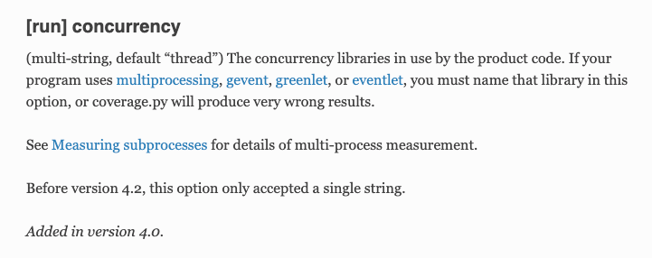

## 문제 요약

FastAPI, SQLAlchemy 등 Python 비동기(greenlet, asyncio) 환경에서  
pytest + pytest-cov로 커버리지 측정 시,  
**coverage.toml(또는 pyproject.toml) 설정의 `[tool.coverage.run] concurrency` 옵션에 `["greenlet"]`을 추가하지 않으면,  
비동기 로직(특히 greenlet 기반 코드)의 커버리지가 누락되는 문제**가 발생했다.

---

## 문제 상황

- FastAPI, SQLAlchemy (async + greenlet) 환경에서 pytest로 테스트 코드 실행
- coverage 설정을 아래처럼 해놓고 테스트
  ```toml
  [tool.coverage.run]
  branch = true
  source = ["apps"]
  ```

* 실제 테스트는 통과하지만, 커버리지 리포트에 서비스 코드의 **비동기 로직 부분이 누락**됨
* (동일한 테스트인데도 일부 함수, 서비스 레이어 등이 누락되어 표시됨.)

---

## 원인 분석

* FastAPI, SQLAlchemy의 async 로직 내부에서 **greenlet** 기반 컨텍스트 전환이 일어남
* coverage.py는 기본적으로 main 스레드의 실행 경로만 추적하기 때문에
  greenlet, gevent, multiprocess 등 컨커런시 프레임워크의 서브 컨텍스트는 별도 설정 없이는 커버리지 추적이 안 됨

---

## 해결 방법

**coverage 설정에 `concurrency = ["greenlet"]` 옵션을 추가**하면 greenlet 기반 비동기 실행 경로도 커버리지 추적이 가능해짐

**최종 설정 예시 (pyproject.toml):**

```toml
[tool.coverage.run]
branch = true
concurrency = ["greenlet"]
source = ["apps"]

[tool.coverage.report]
show_missing = true
skip_empty = true
```

---

## 결론 및 주의 사항

* Python 비동기/병렬 코드(FastAPI, SQLAlchemy 등)는 **concurrency 옵션 누락 시 커버리지가 정확히 측정되지 않는다**
* 반드시 coverage 설정에 `concurrency = ["greenlet"]`을 포함시킬 것
* coverage branch 옵션(`branch = true`)도 함께 사용하면 분기 커버리지까지 측정 가능
* omit 옵션으로 테스트 파일 커버리지 제외 권장

---

## 참고


https://coverage.readthedocs.io/en/latest/config.html#run-concurrency

